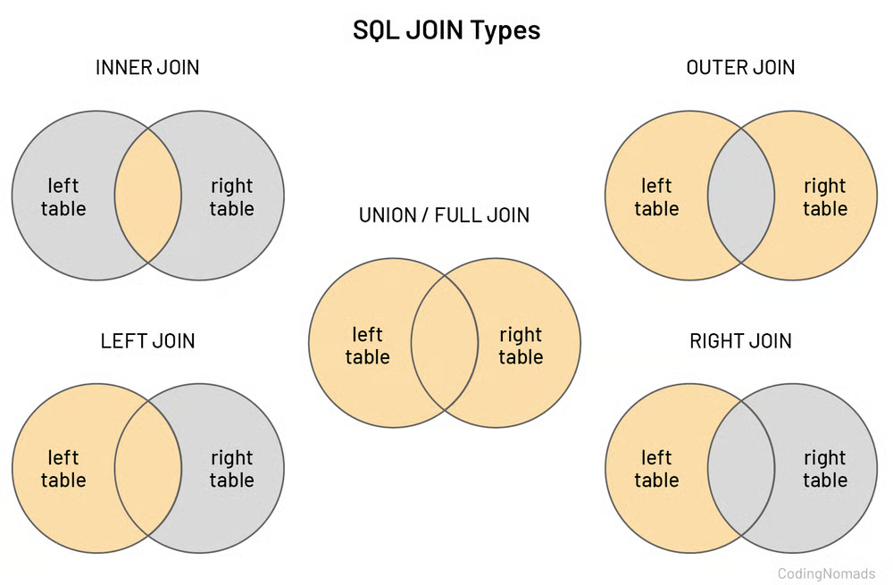

### Record

> Every `row` of a table is called a `Record`

### Attributes

> Every element of a row is called Attributes.

<h3>Student Table</h3>

<table border="1" cellpadding="8">
  <tr>
    <th>ID/Roll</th>
    <th>Name</th>
    <th>Dept_id</th>
  </tr>
  <tr>
    <td>101</td>
    <td>John Doe</td>
    <td>1</td>
  </tr>
  <tr>
    <td>102</td>
    <td>Alex Smith</td>
    <td>2</td>
  </tr>
</table>

---

<h3>Department Table</h3>

<table border="1" cellpadding="8">
  <tr>
    <th>ID</th>
    <th>Dept_Name</th>
  </tr>
  <tr>
    <td>1</td>
    <td>CSE</td>
  </tr>
  <tr>
    <td>2</td>
    <td>EEE</td>
  </tr>
</table>

## Student Table Relationship

**Student:**
> Is called Entity, Collection, Table

**ID/Roll, Name, Phone:**

> Properties of Student table or Attributes

**1, 'Anamul', 017xxxxx :**
> Attributes value

**Unique Identifier:**
 - Every table must have one or multiple unique identifier.
- Is also called `Primary Key.`

### Primary Key:
> To uniquely identify every table there needs a key is called primary key.

## A Table can have multiple Primary key ?
“No, a table cannot have two primary keys. If two columns are unique, one is chosen as the primary key and the other is defined as a unique (alternate) key.”

### Foreign Key:
> Is a key that is `Primary key` of another table.

### Composite Primary Key?

> A composite primary key = 2 or more columns together uniquely identify a row.

## Types of database

**SQL(Structure Query Language):**

> Data are `organised` and `structured` way in a table.
- Mysql
- PostgreSql
- Oracle
- Sqlite
- Maria DB

**NoSQL(Non Relational Language):**

- `Document:`
  1. Mongo DB
  2. Couch DB
- `Key value:`
  1. Redis
  2. Dynamo DB

- `Columnar:`
   1. Apache
   2. Cassandra
   3. H Base

- `Graph:`
   1. Neo4j
   2. Amazon Neptune

- `In memory:`
   1. Redis
   2. Memcached

## SQL vs No Sql

### Use SQL when:

- Data has clear relationships

- You need ACID transactions

- Data structure is fixed

- Accuracy is critical

**Best for:**

- Banking systems

- University / Student systems

- Hospital management (patients, doctors, billing)

- Applications with complex joins

### Use NoSQL when:

- Data is semi-structured or changing

- App needs high scalability

- You want fast development

- Data is mostly document-based

**Best for:**

- MERN stack applications

- Social media apps

- Chat applications

- Real-time apps

- Content management systems

## SQL JOIN

1. Inner Join
2. Left Join
3. Right Join
4. Full Join
5. Outer Join
6. Natural Join

